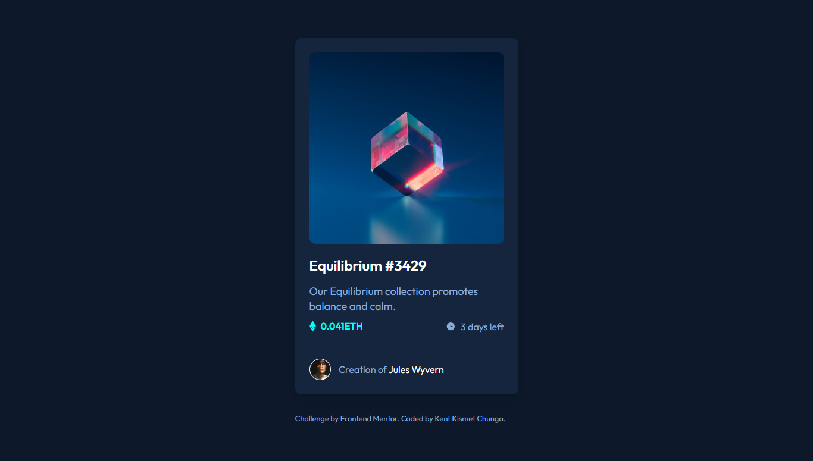
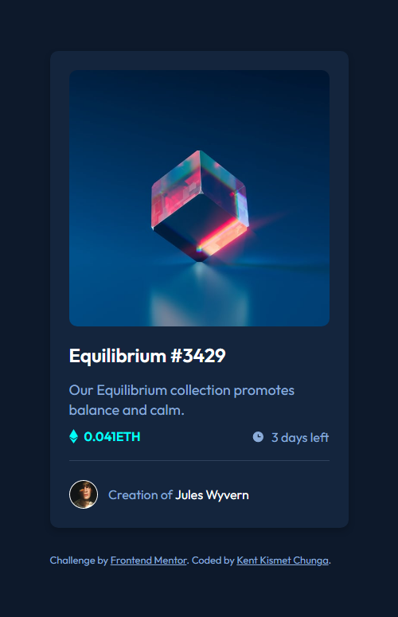

# Frontend Mentor - NFT preview card component solution

This is a solution to the [NFT preview card component challenge on Frontend Mentor](https://www.frontendmentor.io/challenges/nft-preview-card-component-SbdUL_w0U). Frontend Mentor challenges help you improve your coding skills by building realistic projects. 

## Table of contents

- [Overview](#overview)
  - [The challenge](#the-challenge)
  - [Screenshots](#screenshots)
  - [Links](#links)
- [My process](#my-process)
  - [Built with](#built-with)
- [License](#license)
- [Author](#author)

## Overview

### The challenge

Users should be able to:

- View the optimal layout depending on their device's screen size
- See hover states for interactive elements

### Screenshots

##### Desktop preview

##### Mobile preview

### Links

- Solution URL: [https://github.com/KentCP/nft-preview-card-component](https://www.github.com/kentcp/nft-preview-card-component)
- Live Site URL: [https://kentsnftcard.netlify.app/](https://kentsnftcard.netlify.app/)

## My process

### Built with

- Semantic HTML5 markup
- CSS custom properties
- Flexbox
- CSS Grid
- Mobile-first workflow

### Useful resources

- [CSS Opacity / Transparency](https://github.com/KentCP/nft-preview-card-component) - This is an amazing article which helped me finally understand the css opacity property for me to achieve the `hover states for interactive elements.`

##License
This project is licensed under the terms of the MIT license.
Read the full [License](https://github.com/KentCP/nft-preview-card-component/blob/main/LICENSE).

## Author
Let's get in touch :smile:
- Frontend Mentor - [@KentCP](https://www.frontendmentor.io/profile/KentCP)
- Twitter - [@KentChunga](https://www.twitter.com/KentChunga)
- Facebook - [Kent Chunga](https://www.facebook.com/kentkeph.williams)

